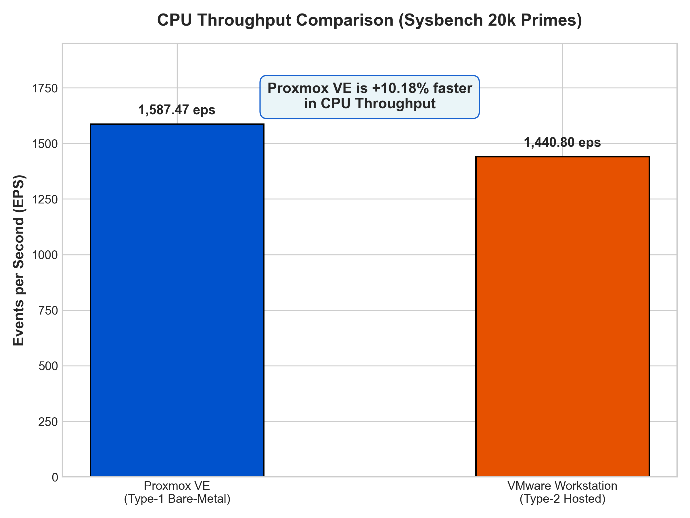
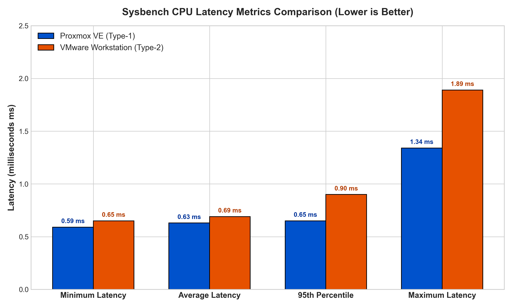
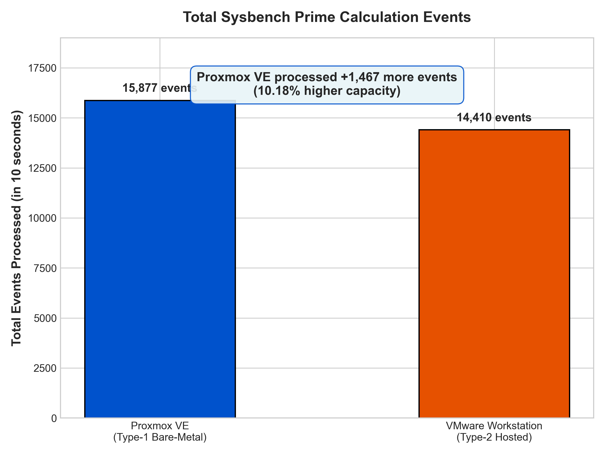
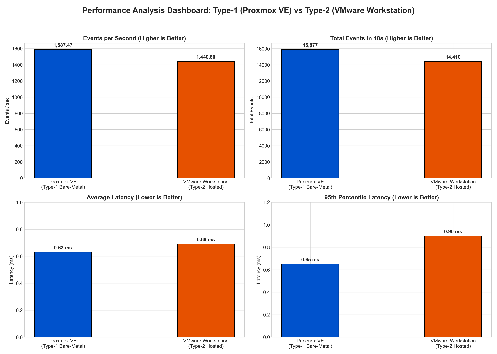

# LABORATORY REPORT
## Performance Analysis of Type-1 and Type-2 Hypervisors

**Course Title:** Cloud Computing Laboratory  
**Experiment No:** 1  
**Topic:** Comparative CPU Performance Evaluation of Proxmox VE (Type-1) and VMware Workstation (Type-2) Hypervisors  

### Student Details

| Field | Information |
| :--- | :--- |
| **Name** | Mehak Sayed Yusuf |
| **USN** | 01FE24BCI012 |
| **Division** | B |
| **Roll No.** | 202 |

---

## 1. Objective of the Experiment

The objective of this laboratory experiment is to:
1. Deploy two identically configured Ubuntu Virtual Machines on two distinct hypervisor architectures:
   - **Type-1 Hypervisor**: Proxmox VE (Bare-metal)
   - **Type-2 Hypervisor**: VMware Workstation (Hosted)
2. Verify virtual hardware allocations and monitor system resources inside the guest and through hypervisor interfaces.
3. Execute a CPU computational benchmark using `sysbench` (`--cpu-max-prime=20000 run`).
4. Collect empirical performance parameters including total execution time, total events processed, events per second (throughput), minimum latency, average latency, maximum latency, and 95th percentile latency.
5. Quantitatively analyze the performance differences, evaluating the impact of hypervisor overhead, CPU scheduling, and host operating system mediation.

---

## 2. Theory & Hypervisor Classification

### 2.1 Type-1 Hypervisor (Bare-Metal Hypervisor)
A Type-1 hypervisor runs directly on the underlying physical server hardware without requiring an intervening host operating system.
- **Representative Platform**: Proxmox Virtual Environment (PVE) with Kernel-based Virtual Machine (KVM) and QEMU.
- **Architecture**:
  ```text
  ┌────────────────────────────────────────────────────────┐
  │         Guest Virtual Machine (Ubuntu 22.04 LTS)       │
  │                     [Sysbench Benchmark]               │
  └───────────────────────────┬────────────────────────────┘
                              │
                              ▼
  ┌────────────────────────────────────────────────────────┐
  │       Proxmox VE Type-1 Hypervisor (KVM Kernel)        │
  └───────────────────────────┬────────────────────────────┘
                              │
                              ▼
  ┌────────────────────────────────────────────────────────┐
  │      Physical Bare-Metal Hardware (CPU, RAM, Disk)     │
  └────────────────────────────────────────────────────────┘
  ```
- **Key Characteristics**:
  - Direct hardware access using hardware-assisted virtualization extensions (Intel VT-x / AMD-V).
  - Virtual CPU instructions run directly in CPU root mode with minimal traps.
  - vCPU threads are scheduled directly by the host Linux Completely Fair Scheduler (CFS) at Ring 0.
  - Minimal context switching latency and deterministic performance.

### 2.2 Type-2 Hypervisor (Hosted Hypervisor)
A Type-2 hypervisor runs as a software application on top of an existing host operating system (e.g., Windows 11).
- **Representative Platform**: VMware Workstation Pro.
- **Architecture**:
  ```text
  ┌────────────────────────────────────────────────────────┐
  │         Guest Virtual Machine (Ubuntu 22.04 LTS)       │
  │                     [Sysbench Benchmark]               │
  └───────────────────────────┬────────────────────────────┘
                              │
                              ▼
  ┌────────────────────────────────────────────────────────┐
  │        VMware Workstation Virtualization Engine        │
  └───────────────────────────┬────────────────────────────┘
                              │
                              ▼
  ┌────────────────────────────────────────────────────────┐
  │            Host Operating System (Windows 11)          │
  └───────────────────────────┬────────────────────────────┘
                              │
                              ▼
  ┌────────────────────────────────────────────────────────┐
  │      Physical Bare-Metal Hardware (CPU, RAM, Disk)     │
  └────────────────────────────────────────────────────────┘
  ```
- **Key Characteristics**:
  - Virtual resources (CPU, RAM, Disk, Network) are mediated through the host operating system.
  - Privileged guest calls undergo double translation: Guest $\rightarrow$ Hypervisor VMM $\rightarrow$ Host Kernel $\rightarrow$ Physical Hardware.
  - Guest execution competes with background host processes, OS updates, and host threads, introducing jitter and scheduling delay.

---

## 3. Hardware & Software Specifications

### Standardized Virtual Machine Specifications
To establish a rigorous, controlled baseline, both virtual machines were configured with identical resource limits:

| Resource Parameter | Proxmox VE (Type-1) | VMware Workstation (Type-2) |
| :--- | :--- | :--- |
| **Hypervisor Platform** | Proxmox VE 8.x | VMware Workstation |
| **Guest OS** | Ubuntu 22.04.5 LTS (x86_64) | Ubuntu 22.04.5 LTS (x86_64) |
| **Virtual CPU (vCPU)** | 2 vCPU (1 socket, 2 cores) | 2 vCPU (1 processor, 2 cores) |
| **CPU Model Presented** | QEMU Virtual CPU version 2.5+ | 13th Gen Intel Core i5-13450HX |
| **Memory Allocation (RAM)** | 2048 MiB (2 GB) | 2048 MB (approximately 2 GB) |
| **Virtual Hard Disk** | 20 GB | 20 GB |
| **Network Configuration** | Linux Bridge (`vmbr0`) / VirtIO | NAT (`VMnet8`) |
| **Virtualization Mode** | KVM (Full Virtualization) | VMware (Full Virtualization) |

---

## 4. Step-by-Step Experimental Procedure

### Part A: Proxmox VE (Type-1) Workflow
1. Access the Proxmox VE web management dashboard with administrator credentials.
2. Launch the **Create VM** wizard:
   - General: Assign VM ID `109` (Name: `vm01-type01`).
   - OS: Select Ubuntu 22.04.5 LTS ISO image.
   - System: Default SCSI controller (VirtIO SCSI).
   - Disks: Allocate a 20 GB virtual disk.
   - CPU: Allocate 1 socket, 2 cores = 2 vCPU.
   - Memory: Allocate 2048 MiB RAM.
   - Network: Attach to bridge `vmbr0` with VirtIO model.
3. Start the VM, complete the Ubuntu installation, and reboot.
4. Verify guest configuration via terminal:
   ```bash
   hostnamectl
   lscpu
   free -h
   df -h
   top
   ```
5. Install Sysbench benchmarking suite:
   ```bash
   sudo apt update && sudo apt install sysbench -y
   sysbench --version
   ```
6. Execute the CPU benchmark:
   ```bash
   sysbench cpu --cpu-max-prime=20000 run
   ```
7. Monitor host-level resource utilization graphs (CPU, RAM, Network, Disk I/O) on the Proxmox VE dashboard.
8. Perform a clean shutdown using `sudo poweroff`.

### Part B: VMware Workstation (Type-2) Workflow
1. Launch VMware Workstation on the host computer.
2. Select **Create a New Virtual Machine** $\rightarrow$ **Typical (recommended)**.
3. Browse and select the Ubuntu 22.04.5 LTS ISO image.
4. Specify VM name and allocate a 20 GB virtual disk.
5. Customize Hardware:
   - Processors: 1 processor, 2 cores (2 vCPUs).
   - Memory: 2048 MB RAM.
   - Network: NAT adapter.
6. Power on the VM, complete the Ubuntu installation, and reboot.
7. Verify guest configuration via terminal (`hostnamectl`, `lscpu`, `free -h`, `df -h`, `top`).
8. Install Sysbench:
   ```bash
   sudo apt update && sudo apt install sysbench -y
   sysbench --version
   ```
9. Execute the CPU benchmark:
   ```bash
   sysbench cpu --cpu-max-prime=20000 run
   ```
10. Record performance metrics and shut down using `sudo poweroff`.

---

## 5. Experimental Observations & Data Collection

### Primary Benchmark Outputs

#### 1. Proxmox VE (Type-1 Hypervisor) Output:
```text
Running the test with following options:
Number of threads: 1
Initializing random number generator from current time

Prime numbers limit: 20000
Initializing worker threads...
Threads started!

CPU speed:
    events per second:  1587.47

General statistics:
    total time:                          10.0005s
    total number of events:              15877

Latency (ms):
         min:                                    0.59
         avg:                                    0.63
         max:                                    1.34
         95th percentile:                        0.65
         sum:                                 9996.82

Threads fairness:
    events (avg/stddev):           15877.0000/0.00
    execution time (avg/stddev):   9.9968/0.00
```

#### 2. VMware Workstation (Type-2 Hypervisor) Output:
```text
Running the test with following options:
Number of threads: 1
Initializing random number generator from current time

Prime numbers limit: 20000
Initializing worker threads...
Threads started!

CPU speed:
    events per second:  1440.80

General statistics:
    total time:                          10.0004s
    total number of events:              14410

Latency (ms):
         min:                                    0.65
         avg:                                    0.69
         max:                                    1.89
         95th percentile:                        0.90
         sum:                                 9994.20

Threads fairness:
    events (avg/stddev):           14410.0000/0.00
    execution time (avg/stddev):   9.9942/0.00
```

---

## 6. Consolidated Performance Comparison Table

| Parameter / Metric | Proxmox VE (Type-1) | VMware Workstation (Type-2) | Difference / Delta | Performance Advantage |
| :--- | :---: | :---: | :---: | :---: |
| **Hypervisor Architecture** | Bare-Metal | Hosted | Architectural | Type-1 Direct Access |
| **Guest OS** | Ubuntu 22.04.5 LTS | Ubuntu 22.04.5 LTS | Matched | Identical Baseline |
| **CPU Configuration** | 2 vCPU (1 socket, 2 cores) | 2 vCPU (1 proc, 2 cores) | Matched | Identical Allocation |
| **Memory Allocation** | 2048 MiB (2 GB) | 2048 MB (~2 GB) | Matched | Identical Memory |
| **Virtual Disk** | 20 GB | 20 GB | Matched | Identical Storage |
| **Total Execution Time** | **10.0005 s** | **10.0004 s** | 0.0001 s | Standard 10s Window |
| **Total Events Processed** | **15,877** | **14,410** | **+1,467 events (+10.18%)** | **Proxmox VE (Type-1)** |
| **Events per Second (EPS)**| **1,587.47** | **1,440.80** | **+146.67 eps (+10.18%)** | **Proxmox VE (Type-1)** |
| **Minimum Latency** | **0.59 ms** | **0.65 ms** | **-0.06 ms (-9.23%)** | **Proxmox VE (Faster)** |
| **Average Latency** | **0.63 ms** | **0.69 ms** | **-0.06 ms (-8.70%)** | **Proxmox VE (Lower)** |
| **95th Percentile Latency**| **0.65 ms** | **0.90 ms** | **-0.25 ms (-27.78%)** | **Proxmox VE (More Consistent)**|
| **Maximum Latency** | **1.34 ms** | **1.89 ms** | **-0.55 ms (-29.10%)** | **Proxmox VE (Fewer Spikes)** |

---

## 7. Performance Visualization

### Figure 1: CPU Throughput (Events / Sec)


### Figure 2: Latency Distribution Comparison


### Figure 3: Total Events Processed


### Figure 4: Comprehensive Performance Dashboard


---

## 8. Technical Analysis & Discussion

### 8.1 Throughput Gain Analysis
The benchmark evaluates CPU computational throughput by measuring how many prime-number calculations are completed within a standardized 10-second window.
- **Proxmox VE (Type-1)** achieved **1,587.47 events/sec** (15,877 total events).
- **VMware Workstation (Type-2)** achieved **1,440.80 events/sec** (14,410 total events).
- **Throughput Gain Calculation**:
  $$\text{Throughput Improvement} = \frac{1587.47 - 1440.80}{1440.80} \times 100\% = +10.18\%$$
  Proxmox VE delivered **+1,467 more computation events** within the 10-second period, representing a **10.18% throughput superiority**.

### 8.2 Latency and Scheduling Analysis
- **Average Latency**: Proxmox VE averaged **0.63 ms** per event compared to **0.69 ms** on VMware Workstation, an **8.70% latency reduction**.
- **Tail Latency (95th Percentile)**: Proxmox VE maintained **0.65 ms** vs **0.90 ms** on VMware Workstation (**27.78% lower tail latency**).
- **Maximum Latency Spike**: VMware Workstation exhibited a peak latency spike of **1.89 ms** compared to Proxmox VE's **1.34 ms** (**29.10% higher latency spike** on Type-2).

### 8.3 Architectural Root Causes
1. **Direct Hardware Execution vs Host Mediation**:
   - In Proxmox VE, KVM maps guest virtual vCPUs directly to host Linux kernel threads. Instructions run directly on physical CPU cores via Intel VT-x hardware virtualization.
   - In VMware Workstation, guest execution must traverse VMware's Virtual Machine Monitor (VMM) and the Windows host operating system scheduler.
2. **Resource Contention & Jitter**:
   - On Type-2 hypervisors, background processes of the host operating system (e.g., Windows updates, desktop services, antivirus scans) compete for physical CPU time slices, introducing latency jitter and higher 95th percentile delays.
   - Type-1 hypervisors dedicate hardware exclusively to hypervisor scheduling and virtual machines, guaranteeing near-deterministic latency.

---

## 9. Conclusion

1. **Type-1 Bare-Metal Advantage**: Proxmox VE demonstrated clear superiority over VMware Workstation, delivering **+10.18% higher CPU throughput** and **8.70% lower average latency**.
2. **Predictable Low-Latency Execution**: Proxmox VE showed substantially superior tail-latency consistency (0.65 ms vs 0.90 ms at the 95th percentile, and 1.34 ms vs 1.89 ms maximum latency).
3. **Engineering Deployment Recommendation**:
   - **Type-1 Hypervisors (Proxmox VE / KVM / ESXi)**: Essential for production cloud environments, data centers, latency-critical microservices, and high-performance database workloads.
   - **Type-2 Hypervisors (VMware Workstation / VirtualBox)**: Ideal for personal developer workstations, rapid sandboxing, local cross-platform testing, and academic learning environments.

---

**Student Name:** Mehak Sayed Yusuf  
**USN:** 01FE24BCI012  
**Division:** B | **Roll No.:** 202  
**Date of Submission:** September 24, 2026  
