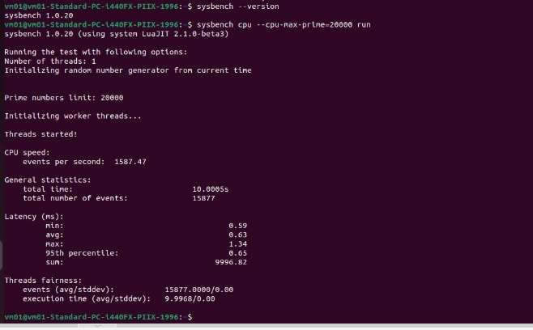
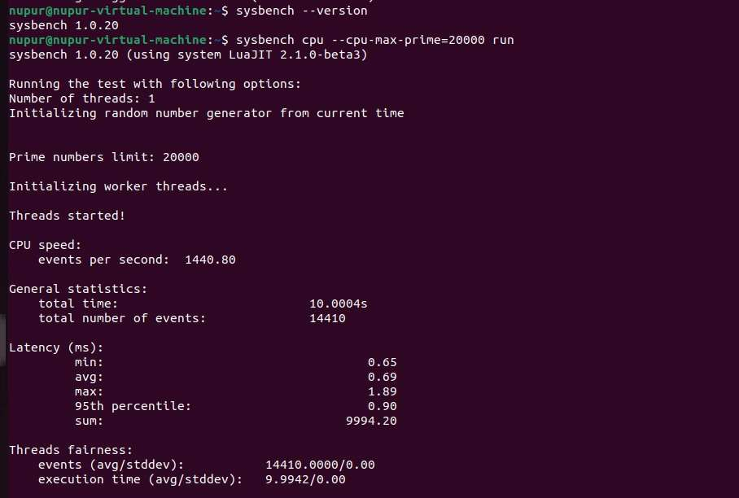

# Cloud Computing Lab: Hypervisor Performance Benchmarking

An empirical performance evaluation comparing **Type-1 (Bare-Metal)** and **Type-2 (Hosted)** hypervisors under standardized computational CPU workloads.

---

### Author Metadata

- **Name:** Mehak Sayed Yusuf
- **USN:** 01FE24BCI012
- **Division:** B | **Roll No.:** 202
- **Course:** Cloud Computing Laboratory

---

## 1. Executive Summary

This study evaluates computational efficiency and virtualization tax by benchmarking two distinct hypervisor architectures using identical Ubuntu 22.04 LTS guest virtual machines. 

### Key Findings
- **Throughput:** Proxmox VE (Type-1) achieved **1,587.47 events/sec** versus VMware Workstation's **1,440.80 events/sec**, delivering a **+10.18% throughput advantage**.
- **Latency Consistency:** Proxmox VE demonstrated lower mean latency (**0.63 ms** vs **0.69 ms**) and significantly tighter tail latency (**0.65 ms** vs **0.90 ms** at the 95th percentile).
- **Peak Latency Jitter:** VMware Workstation experienced **29.10% higher peak latency spikes** (1.89 ms vs 1.34 ms), illustrating the scheduling interference inherent in hosted virtualization.

---

## 2. Architectural Comparison

```text
       Type-1: Proxmox VE (Bare-Metal)               Type-2: VMware Workstation (Hosted)
  ┌─────────────────────────────────────────┐   ┌─────────────────────────────────────────┐
  │     Ubuntu 22.04 VM (Sysbench Workload) │   │     Ubuntu 22.04 VM (Sysbench Workload) │
  ├─────────────────────────────────────────┤   ├─────────────────────────────────────────┤
  │   KVM / QEMU Virtual Hardware Layer     │   │   VMware Virtual Hardware Engine        │
  ├─────────────────────────────────────────┤   ├─────────────────────────────────────────┤
  │   Proxmox VE Hypervisor Core (Debian)   │   │   Host Operating System (Windows 11)    │
  ├─────────────────────────────────────────┤   ├─────────────────────────────────────────┤
  │       Physical Bare-Metal Hardware      │   │       Physical Bare-Metal Hardware      │
  └─────────────────────────────────────────┘   └─────────────────────────────────────────┘
```

- **Type-1 (Proxmox VE / KVM):** The hypervisor controls physical resources directly. Virtual CPUs execute instructions via hardware-assisted extensions (Intel VT-x) with minimal abstraction.
- **Type-2 (VMware Workstation):** The hypervisor runs as an application atop a host OS. Virtual resources and thread execution are subject to host scheduler arbitration and OS context switches.

---

## 3. Testbed Specifications & Workload Profile

To ensure strict experimental control, identical virtual hardware constraints were provisioned on both platforms:

| Parameter | Proxmox VE (Type-1) | VMware Workstation (Type-2) | Control Status |
| :--- | :--- | :--- | :---: |
| **Guest OS** | Ubuntu 22.04.5 LTS (x86_64) | Ubuntu 22.04.5 LTS (x86_64) | Matched |
| **vCPU Allocation** | 2 vCPU (1 socket, 2 cores) | 2 vCPU (1 processor, 2 cores) | Matched |
| **Memory Allocation** | 2048 MiB (2 GB RAM) | 2048 MB (~2 GB RAM) | Matched |
| **Virtual Disk** | 20 GB Virtual Storage | 20 GB Virtual Storage | Matched |
| **Network Mode** | Bridged (`vmbr0`) | NAT (`VMnet8`) | Configured |
| **Hardware Introspection**| `QEMU Virtual CPU 2.5+` | `Intel Core i5-13450HX` | Presented |

### Workload Command
CPU performance was benchmarked using `sysbench` calculating prime numbers up to 20,000 using 1 worker thread over a 10-second sampling window:

```bash
# Install benchmark utility
sudo apt update && sudo apt install sysbench -y

# Run prime computation benchmark
sysbench cpu --cpu-max-prime=20000 run
```

---

## 4. Benchmark Console Evidence

### Proxmox VE (Type-1 Hypervisor)
Captured execution output from the Proxmox VE Ubuntu virtual machine:



*Figure 1: Proxmox VE Sysbench Benchmark Console Output.*

---

### VMware Workstation (Type-2 Hypervisor)
Captured execution output from the VMware Workstation Ubuntu virtual machine:



*Figure 2: VMware Workstation Sysbench Benchmark Console Output.*

---

## 5. Comparative Performance Results

| Measured Metric | Proxmox VE (Type-1) | VMware Workstation (Type-2) | Variance / Delta | Advantage |
| :--- | :---: | :---: | :---: | :---: |
| **Total Test Duration** | **10.0005 s** | **10.0004 s** | 0.0001 s | Standard 10s Window |
| **Total Events Completed** | **15,877** | **14,410** | **+1,467 events** | **Proxmox VE (+10.18%)** |
| **Throughput (EPS)** | **1,587.47** | **1,440.80** | **+146.67 eps** | **Proxmox VE (+10.18%)** |
| **Minimum Latency** | **0.59 ms** | **0.65 ms** | **-0.06 ms** | **Proxmox VE (9.2% faster)** |
| **Average Latency** | **0.63 ms** | **0.69 ms** | **-0.06 ms** | **Proxmox VE (8.7% faster)** |
| **95th Percentile Latency** | **0.65 ms** | **0.90 ms** | **-0.25 ms** | **Proxmox VE (27.8% lower)** |
| **Maximum Latency** | **1.34 ms** | **1.89 ms** | **-0.55 ms** | **Proxmox VE (29.1% lower)** |

---

## 6. Graphical Performance Profiles

### 6.1 Computational Throughput

*Figure 3: Events processed per second under sustained CPU stress.*

---

### 6.2 Latency Distribution Profile

*Figure 4: Latency profile showing tighter bounds and reduced tail latency on Type-1.*

---

### 6.3 Total Workload Capacity

*Figure 5: Total prime calculation events completed across the 10-second window.*

---

### 6.4 Multi-Metric Performance Overview

*Figure 6: Consolidated evaluation dashboard.*

---

## 7. Systems Engineering Insights

1. **Kernel Scheduler Integration:**  
   In Proxmox VE, KVM maps guest virtual CPUs directly to host Linux kernel POSIX threads. Instructions execute directly on physical cores via hardware VMX mode, eliminating intermediate system call translation.
2. **Host Operating System Contention:**  
   VMware Workstation operates within user space on the Windows host. Guest execution competes with background host processes (antivirus, background services, UI rendering), inducing scheduling latency and higher peak spikes (1.89 ms vs 1.34 ms).
3. **Tail Latency Predictability:**  
   Proxmox VE exhibited stable execution times with a 95th percentile latency of 0.65 ms (compared to 0.90 ms on VMware), making bare-metal hypervisors essential for latency-sensitive service-level agreements (SLAs).

---

## 8. Deployment Recommendations

| Requirement | Preferred Architecture | Rationale |
| :--- | :--- | :--- |
| **Cloud Infrastructure & Data Centers** | **Type-1 (Proxmox VE / KVM / ESXi)** | Zero host OS overhead, high throughput, and deterministic latency. |
| **Database & Real-Time Computing** | **Type-1 (Proxmox VE / KVM)** | Predictable low tail latency and direct hardware I/O mapping. |
| **Local Development & Sandboxing** | **Type-2 (VMware / VirtualBox)** | Quick provisioning, seamless desktop integration, and hardware portability. |

---

## 9. Reproducibility & Scripts

The repository includes automation and plotting utilities in the `scripts/` directory:

```bash
# 1. Automated VM benchmark & telemetry
chmod +x scripts/benchmark.sh
./scripts/benchmark.sh

# 2. Re-generate comparative visualization plots
python scripts/generate_plots.py

# 3. Compute delta ratios and percentage margins
python scripts/parse_sysbench.py
```

---
*Laboratory Experiment conducted for Cloud Computing Laboratory Course.*
